# 🚀 AeroHedge

<div align="center">

### High-Performance Quantitative Risk Engine for Real-Time Delta Hedging

*Ultra-Low Latency • Modern C++20 • Lock-Free Concurrency • Quantitative Finance • Financial Systems Engineering*

---


</div>

---

# 📖 Executive Summary

AeroHedge is a modern quantitative trading engine designed to simulate how
professional options market makers continuously manage portfolio risk in
real time.

The project combines **financial mathematics**, **low-latency systems
engineering**, and **high-performance concurrent programming** into a
single architecture capable of processing market data, computing option
Greeks, evaluating portfolio exposure, and generating hedge orders with
minimal latency.

Instead of focusing solely on pricing options, AeroHedge models the
complete lifecycle of a trading system:

- Receiving live market data
- Computing portfolio risk
- Monitoring delta exposure
- Executing hedge decisions
- Streaming telemetry
- Visualizing system performance

The engine is implemented primarily in **Modern C++20**, while
**Python + FastAPI** provide asynchronous monitoring services and
dashboard integration.

---

# ✨ Key Features

## Quantitative Finance

- Black-Scholes-Merton option pricing
- Real-time Delta computation
- Portfolio Delta aggregation
- Automatic Delta-neutral hedging
- Continuous risk monitoring
- Option Greeks framework

---

## Low-Latency Engineering

- Lock-free SPSC queues
- Cache-aware memory layouts
- Zero-copy packet processing
- Hardware timestamping
- Non-blocking networking
- Memory-order optimized atomics

---

## Systems Programming

- Modern C++20
- Multithreading
- Concurrent pipelines
- Ring buffer architecture
- Binary protocol serialization
- High-performance networking

---

## Telemetry

- UDP metrics streaming
- FastAPI bridge
- WebSocket broadcasting
- Live dashboard
- Latency monitoring
- Throughput visualization

---

# 🏗 High-Level Architecture

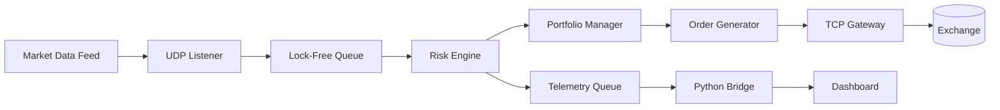

---

# 🎯 Design Goals

The primary objectives behind AeroHedge are:

- Deterministic execution
- Predictable latency
- Cache-efficient memory access
- Zero unnecessary synchronization
- Lock-free communication
- High numerical stability
- Modular financial models
- Real-time visualization
- Clean extensible architecture

---

# 📂 Repository Layout

```text
AeroHedge
│
├── include/
│   └── aerohedge/
│       ├── market/
│       ├── math/
│       ├── engine/
│       ├── execution/
│       ├── telemetry/
│       ├── network/
│       ├── concurrency/
│       └── utils/
│
├── src/
│
├── dashboard/
│
├── scripts/
│
├── tests/
│
├── docs/
│
├── CMakeLists.txt
│
└── README.md
```

---

# ⚙ Technology Stack

| Layer | Technology |
|---------|------------|
| Language | C++20 |
| Backend | Python |
| Framework | FastAPI |
| Networking | TCP / UDP |
| Build | CMake |
| Compiler | GCC / Clang |
| Visualization | HTML5 + JavaScript |
| Concurrency | std::atomic |
| Data Structures | Lock-Free SPSC Queue |

---

# 🔄 End-to-End Data Flow

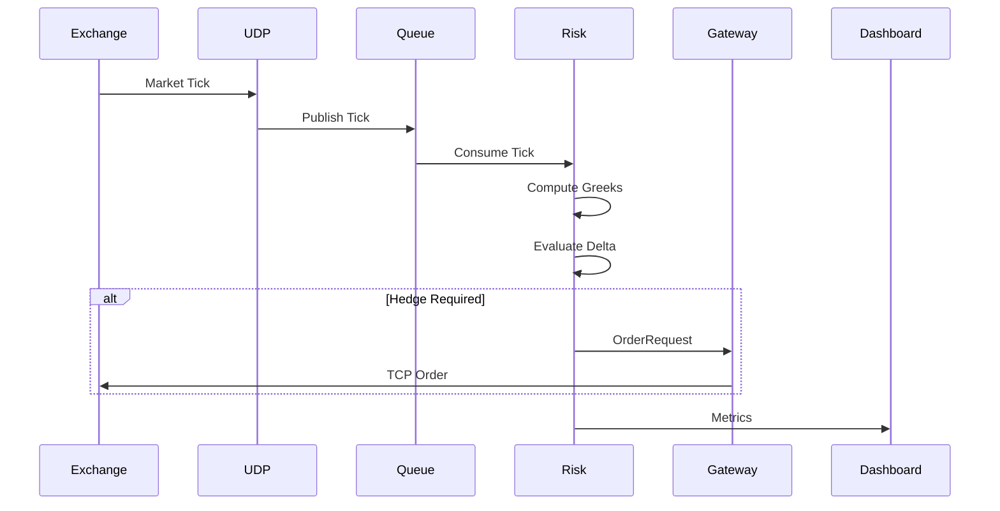

---

# 📈 Core Pipeline

```text
Market Tick
     │
     ▼
UDP Receiver
     │
     ▼
Lock-Free Queue
     │
     ▼
Risk Engine
     │
     ├────────► Greeks
     │
     ├────────► Portfolio Delta
     │
     ├────────► Hedge Decision
     │
     ▼
Execution Gateway
     │
     ▼
Exchange
```

---

# 🚀 Why AeroHedge?

Most academic option pricing projects stop after computing the Black-Scholes equation.

AeroHedge extends beyond pricing by modeling the infrastructure surrounding
real-world electronic trading systems.

The project integrates financial mathematics with systems programming to
illustrate how market data ingestion, concurrent computation, risk
evaluation, and order execution interact inside a latency-sensitive
architecture.

The emphasis is on software design, concurrency, modularity, and
performance-aware implementation rather than on building a production
trading platform.

---

# 📑 Table of Contents

1. Quantitative Foundations
2. Black-Scholes Mathematics
3. Option Greeks
4. Dynamic Delta Hedging
5. System Architecture
6. Low-Latency Design
7. Lock-Free Concurrency
8. Market Data Pipeline
9. Module Documentation
10. Telemetry Pipeline
11. Dashboard
12. Build Instructions
13. Performance Notes
14. Future Work
15. References
16. License

---

# 📐 Quantitative Foundations

AeroHedge is built around one of the most fundamental concepts in quantitative
finance:

> **Risk should be managed continuously rather than periodically.**

Instead of treating options as static contracts, the engine continuously
recomputes portfolio exposure whenever new market information arrives.

Every incoming market tick updates the state of the portfolio, causing the
engine to:

1. Reprice affected instruments
2. Recompute option Greeks
3. Aggregate portfolio exposure
4. Evaluate hedge requirements
5. Generate hedge orders when necessary

This event-driven architecture closely resembles the design philosophy of
modern electronic trading systems.

---

# 📈 Market Tick Processing

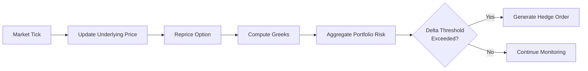

---

# 📊 Black–Scholes–Merton Model

The Black–Scholes model provides a theoretical price for European options
under several simplifying assumptions:

- Continuous trading
- Constant volatility
- Constant risk-free interest rate
- No arbitrage opportunities
- Log-normal asset prices
- Frictionless markets

The underlying asset is modeled using **Geometric Brownian Motion**.

\[
dS_t=\mu S_tdt+\sigma S_tdW_t
\]

where

| Symbol | Meaning |
|---------|----------|
| \(S_t\) | Asset Price |
| \(\mu\) | Expected Return |
| \(\sigma\) | Volatility |
| \(W_t\) | Brownian Motion |

---

# 📘 Black–Scholes Pricing Equation

For a European Call Option,

\[
C=S\Phi(d_1)-Ke^{-rT}\Phi(d_2)
\]

where

\[
d_1=
\frac{
\ln(S/K)+
\left(r+\frac{\sigma^2}{2}\right)T
}
{\sigma\sqrt{T}}
\]

\[
d_2=d_1-\sigma\sqrt{T}
\]

The AeroHedge pricing engine computes these values continuously as market
prices evolve.

---

# 📊 Option Greeks

Rather than focusing only on option prices, AeroHedge primarily monitors
**risk sensitivities**.

These sensitivities describe how an option reacts to changing market
conditions.

---

## Δ Delta

Delta measures how much an option price changes when the underlying asset
moves.

\[
\Delta=\frac{\partial V}{\partial S}
\]

Interpretation:

- Call options have positive Delta
- Put options have negative Delta
- Large absolute Delta implies higher directional exposure

---

## Γ Gamma

Gamma measures how rapidly Delta changes.

\[
\Gamma=
\frac{\partial^2V}
{\partial S^2}
\]

High Gamma indicates rapidly changing risk.

---

## Θ Theta

Theta measures time decay.

\[
\Theta=
\frac{\partial V}
{\partial t}
\]

As expiration approaches, option value naturally decreases.

---

## Vega

Vega measures sensitivity to volatility.

\[
Vega=
\frac{\partial V}
{\partial \sigma}
\]

Higher implied volatility generally increases option premiums.

---

## Rho

Rho measures sensitivity to interest rates.

\[
Rho=
\frac{\partial V}
{\partial r}
\]

Although less significant for short-dated options, it becomes increasingly
important for longer maturities.

---

# 📊 Greeks Overview

| Greek | Measures |
|--------|----------|
| Delta | Price sensitivity |
| Gamma | Delta sensitivity |
| Theta | Time decay |
| Vega | Volatility sensitivity |
| Rho | Interest rate sensitivity |

---

# 🎯 Why Delta Matters

Delta represents directional exposure.

Suppose the portfolio contains several option positions.

| Position | Delta |
|-----------|-------|
| Call A | +0.62 |
| Call B | +0.48 |
| Put A | -0.21 |
| Stock Position | +0.30 |

Total portfolio Delta becomes

\[
0.62+0.48-0.21+0.30=1.19
\]

This means the portfolio behaves approximately like holding **1.19 shares**
of the underlying asset.

---

# ⚖ Dynamic Delta Hedging

Rather than waiting for periodic updates,
AeroHedge evaluates Delta continuously.

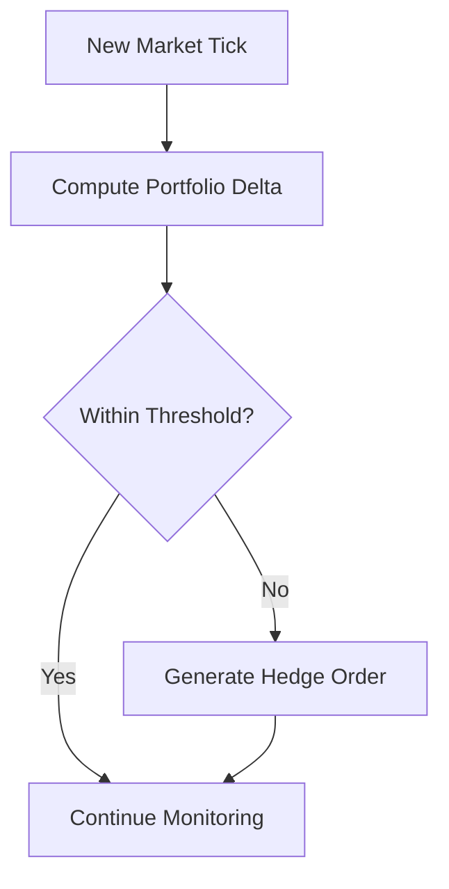

---

# 📉 Hedge Decision

Suppose

\[
|\Delta_{portfolio}|>\tau
\]

where

- \(\tau\) is the acceptable exposure threshold.

If exceeded,

the required hedge quantity becomes

\[
Q_{hedge}
=
-\Delta_{portfolio}
\times
ContractSize
\]

For equity options,

Contract Size is commonly

\[
100
\]

shares per contract.

---

# 📦 Example

Portfolio Delta

```
+2.35
```

Threshold

```
0.50
```

Required Hedge

```
-235 shares
```

The engine therefore generates a SELL order
for approximately 235 shares to restore
near Delta neutrality.

---

# 🧠 Continuous Risk Engine

```text
Market Tick

      │

      ▼

Underlying Price Updated

      │

      ▼

Black-Scholes Pricing

      │

      ▼

Greeks Computed

      │

      ▼

Portfolio Delta Updated

      │

      ▼

Threshold Evaluation

      │

      ├───────────────┐
      │               │
      ▼               ▼

 No Hedge       Hedge Required

      │               │

      ▼               ▼

 Continue      Generate Order
```

---

# 📈 Event-Driven Risk Management

Unlike batch-processing financial software,
AeroHedge treats every market update as a
new state transition.

Each incoming tick immediately propagates through:

- Pricing
- Greeks
- Portfolio State
- Exposure Analysis
- Hedge Decision
- Execution

This event-driven workflow enables the engine to react
continuously as market conditions evolve while maintaining
a modular architecture that cleanly separates market data,
pricing, risk management, and execution.

---

# ⚡ Low-Latency Systems Engineering

Modern electronic markets generate thousands to millions of updates every
second. In such environments, the performance of a trading system is
determined not only by algorithmic complexity but also by cache behavior,
memory layout, synchronization strategy, and network efficiency.

AeroHedge is designed around predictable execution by minimizing unnecessary
memory allocations, reducing synchronization overhead, and separating
time-critical processing from auxiliary tasks such as telemetry.

---

# 🧠 Design Philosophy

The engine follows several guiding principles:

- Process each market tick exactly once.
- Avoid unnecessary dynamic memory allocation on the critical path.
- Use contiguous memory layouts whenever possible.
- Minimize synchronization between worker threads.
- Separate latency-sensitive processing from monitoring.
- Favor deterministic execution over maximum throughput.

---

# 🏛 Processing Pipeline

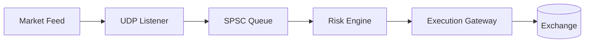

Each stage has a single responsibility and communicates through lightweight,
well-defined interfaces.

---

# 💾 Cache-Aware Data Layout

Modern CPUs operate on **cache lines**, typically 64 bytes in size. Accessing
data already present in the L1 cache is significantly faster than retrieving
it from main memory.

AeroHedge groups frequently accessed fields together and keeps market data
structures compact to improve cache locality during sequential processing.

```text
64 Byte Cache Line

+--------------------------------------------------------------+
| Tick 1                     | Tick 2                          |
+--------------------------------------------------------------+
```

Compact data layouts reduce cache misses and improve overall throughput.

---

# 📦 Struct Organization

Market data is represented as a lightweight structure that stores the
information required by the pricing and risk engines.

Typical fields include:

- Timestamp
- Instrument Identifier
- Price
- Volume
- Internal Timing Metadata

The objective is to maintain predictable memory access patterns while avoiding
unnecessary padding where practical.

---

# 🔄 Lock-Free Communication

Market data ingestion and risk computation execute on separate threads.

Rather than sharing mutable state protected by locks, AeroHedge exchanges data
through a **Single Producer – Single Consumer (SPSC)** ring buffer.

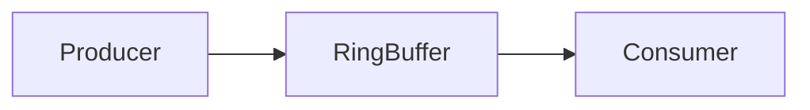

This design reduces synchronization overhead and allows producer and consumer
threads to progress independently.

---

# 🔁 Circular Buffer

```text
Capacity = N

+------------------------------------------------------+
| Tick | Tick | Tick | Tick | Tick | Tick | Tick | ... |
+------------------------------------------------------+
   ^                                           ^
 Head                                        Tail
```

The producer writes new market ticks while the consumer removes processed
entries.

When the end of the buffer is reached, indices wrap around to the beginning,
forming a circular structure.

---

# ⚙ Power-of-Two Buffers

Using a buffer whose capacity is a power of two simplifies index management.

Instead of performing an expensive modulo operation for each access, the
implementation can use efficient bit masking to wrap indices.

Conceptually,

```cpp
next = (current + 1) & mask;
```

This is a common optimization in ring-buffer implementations.

---

# 🔒 Atomic Synchronization

The producer and consumer coordinate using atomic variables.

Typical operations include:

- relaxed loads for local progress
- acquire semantics when reading shared state
- release semantics after publishing updates

These memory-order guarantees ensure that data becomes visible in the intended
order without introducing full synchronization barriers.

---

# 🚫 Avoiding False Sharing

If two frequently modified variables occupy the same cache line, processor
cores may repeatedly invalidate each other's caches.

AeroHedge avoids this by separating heavily updated synchronization variables
onto independent cache lines where appropriate.

```text
Without Separation

+------------------------------+
| Head | Tail |
+------------------------------+

Frequent cache invalidation

----------------------------

With Separation

+------------------------------+
| Head                         |
+------------------------------+

+------------------------------+
| Tail                         |
+------------------------------+
```

This reduces unnecessary cache-coherency traffic.

---

# 🌐 Market Data Ingestion

Incoming market data enters the engine through the networking layer.

Processing follows a simple sequence:

1. Receive binary market message.
2. Decode required fields.
3. Attach internal timestamp.
4. Publish to processing queue.
5. Continue listening.

This pipeline keeps network handling isolated from pricing logic.

---

# ⏱ High-Resolution Timing

To measure processing latency, AeroHedge records timestamps at key stages of
the pipeline.

Representative timing points include:

- Packet arrival
- Queue insertion
- Queue removal
- Risk computation
- Order generation
- Network transmission

Collecting timestamps throughout the pipeline enables latency analysis without
coupling measurement logic to business logic.

---

# 📊 End-to-End Pipeline

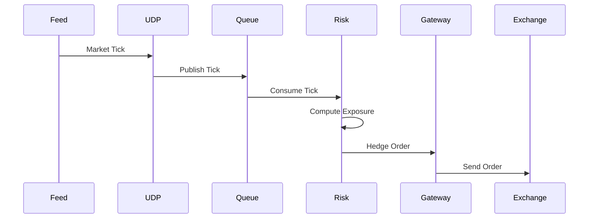

---

# 🧩 Modular Design

Each subsystem has a clearly defined responsibility.

| Module | Responsibility |
|---------|----------------|
| Networking | Receive market data |
| Queue | Transfer data between threads |
| Pricing | Option valuation |
| Risk | Portfolio exposure |
| Execution | Submit hedge orders |
| Telemetry | Publish metrics |

This separation improves maintainability and makes future extensions easier.

---

# 🎯 Engineering Goals

The implementation emphasizes:

- Predictable execution
- Cache-friendly memory access
- Minimal synchronization
- Modular architecture
- Separation of concerns
- Maintainable C++20 design
- Efficient communication between components

These principles form the systems foundation upon which the quantitative
components of AeroHedge are built.


---

# 🏛 System Architecture

AeroHedge is organized as a collection of independent components connected
through lightweight interfaces. Each subsystem has a single responsibility,
making the engine easier to extend, test, and optimize.

The architecture separates **market data ingestion**, **risk computation**,
**order execution**, and **telemetry**, ensuring that visualization and
monitoring never interfere with the latency-sensitive execution path.

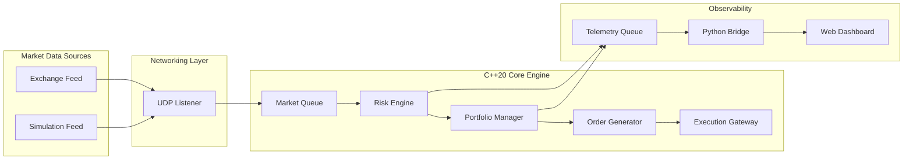

---

# 📡 Market Data Pipeline

Every incoming market update passes through a deterministic processing
pipeline.

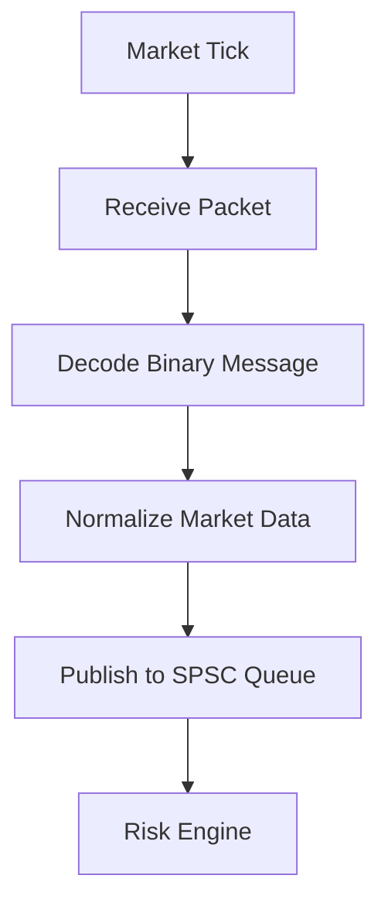

Each stage performs one well-defined task before handing the event to the
next stage.

---

# 📈 Portfolio State

The risk engine maintains a continuously updated portfolio state.

```text
Portfolio

├── Cash Balance
├── Stock Positions
├── Option Positions
├── Net Delta
├── Net Gamma
├── Unrealized P&L
└── Realized P&L
```

Whenever a market price changes, the portfolio is recomputed to reflect the
latest exposure.

---

# 🧠 Risk Engine Workflow

The Risk Engine is the computational heart of AeroHedge.

For each incoming market event it performs the following operations:

1. Update underlying market price.
2. Revalue option positions.
3. Compute Greeks.
4. Aggregate portfolio exposure.
5. Compare exposure against configured limits.
6. Produce hedge instructions if required.

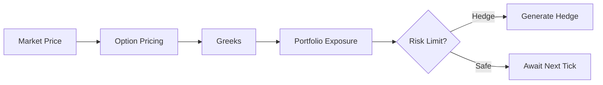

---

# ⚖ Portfolio Risk Evaluation

Rather than evaluating each option independently,
AeroHedge evaluates the portfolio as a whole.

The aggregate portfolio exposure may include

- Delta
- Gamma
- Vega
- Cash
- Stock Inventory

The engine can therefore hedge the combined exposure instead of individual
contracts.

---

# 📤 Order Generation

When portfolio exposure exceeds the configured threshold,
the execution layer constructs an order request.

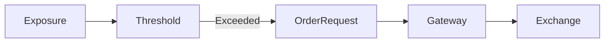

Each generated order contains only the information required by the execution
layer, allowing pricing logic to remain independent from networking code.

---

# 🌐 Execution Gateway

The execution gateway is responsible for transmitting orders to the exchange.

Responsibilities include:

- Maintaining network connections
- Serializing outbound messages
- Handling transmission failures
- Recording execution timestamps
- Reporting execution status

Separating networking from pricing reduces coupling between system
components.

---

# 📊 Telemetry Pipeline

Monitoring is intentionally separated from trading logic.

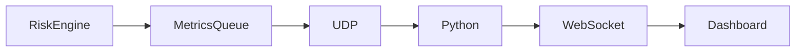

This architecture allows metrics to be collected and visualized without
blocking the main execution pipeline.

---

# 🧵 Thread Model

AeroHedge can be viewed as a collection of cooperative worker threads.

```text
Thread 1
└── Market Data Receiver

Thread 2
└── Risk Engine

Thread 3
└── Order Gateway

Thread 4
└── Telemetry Publisher

Python Process
└── Dashboard Service
```

Each thread owns a distinct responsibility and communicates using queues
rather than shared mutable state wherever practical.

---

# 📦 Module Responsibilities

| Module | Purpose |
|---------|---------|
| `market_data.hpp` | Market event representation |
| `udp_listener.hpp` | Receive market packets |
| `spsc_queue.hpp` | Lock-free communication |
| `risk_engine.hpp` | Pricing and exposure |
| `portfolio.hpp` | Position management |
| `order_gateway.hpp` | Outbound execution |
| `telemetry.hpp` | Metrics publishing |
| `dashboard.html` | Live visualization |

---

# 🔍 Separation of Concerns

AeroHedge divides responsibilities into four logical layers.

```text
Presentation Layer
└── Dashboard

Telemetry Layer
└── Metrics Streaming

Business Logic
├── Pricing
├── Risk
└── Portfolio

Infrastructure
├── Networking
├── Queues
├── Timing
└── Memory
```

This layered organization makes the project easier to maintain and extend.

---

# 🚀 Extensibility

The architecture is designed so that additional capabilities can be added
without significant changes to existing components.

Potential extensions include:

- Multiple exchanges
- Additional option pricing models
- Volatility surface calibration
- Multi-asset portfolios
- Risk limits
- Historical replay
- Strategy plug-in framework
- Backtesting engine
- Persistent trade storage
- Performance benchmarking suite

---

# 🎯 Architectural Principles

The overall design emphasizes:

- Modular components
- Deterministic execution
- Efficient data movement
- Low synchronization overhead
- Clear ownership boundaries
- Scalable concurrency
- Maintainable C++20 code
- Separation between execution and observability

These principles allow AeroHedge to serve as both a quantitative finance
project and a demonstration of modern systems engineering techniques.


---

# 🧵 Concurrent Processing & Risk Engine

Once market events enter the system, AeroHedge transitions from network
processing to quantitative analysis. This stage is responsible for moving
market data safely between threads, computing portfolio exposure, and
initiating hedge operations whenever predefined risk limits are exceeded.

---

# 🔄 `spsc_queue.hpp`

## Purpose

The `SPSCQueue` (Single Producer – Single Consumer Queue) provides a
lightweight communication channel between independent worker threads.

Rather than relying on locks, condition variables, or shared mutable
containers, the queue enables one producer thread and one consumer thread to
exchange market events with minimal synchronization overhead.

---

## Responsibilities

- Transfer market ticks between threads
- Preserve FIFO ordering
- Eliminate mutex contention
- Support continuous streaming workloads
- Reduce synchronization latency

---

## Queue Architecture

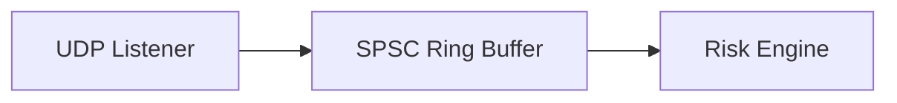

---

## Internal Layout

```text
+-----------------------------------------------------------+
| Tick | Tick | Tick | Tick | Tick | Tick | Tick | Tick |
+-----------------------------------------------------------+

 Write Index ---------------------------->

 Read Index  ------------------->
```

The producer advances the write index after inserting new data, while the
consumer advances the read index after processing entries.

---

## Why Lock-Free?

Traditional synchronization mechanisms introduce additional scheduling
overhead and can reduce throughput under sustained workloads.

A lock-free queue allows producer and consumer threads to make progress
independently, avoiding unnecessary blocking while preserving a simple
communication model.

---

## Memory Ordering

Synchronization relies on atomic operations with carefully chosen memory
ordering semantics.

Typical operations include:

- relaxed loads for thread-local progress
- acquire operations when consuming shared data
- release operations after publishing updates

These guarantees ensure that consumers observe fully initialized data while
avoiding stronger synchronization than necessary.

---

## Design Principles

The queue implementation emphasizes:

- predictable execution
- bounded memory usage
- contiguous storage
- efficient index updates
- clear ownership between producer and consumer

---

# 🧠 `risk_engine.hpp`

## Purpose

The Risk Engine is responsible for transforming market prices into actionable
portfolio decisions.

Whenever a new market tick arrives, the engine updates instrument values,
recomputes option sensitivities, evaluates aggregate exposure, and determines
whether hedging activity is required.

---

## Responsibilities

- Price financial instruments
- Compute option Greeks
- Aggregate portfolio exposure
- Evaluate risk thresholds
- Generate hedge instructions

---

## Processing Pipeline

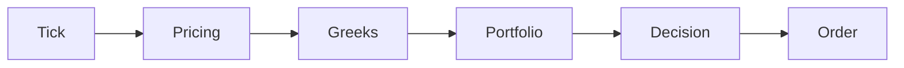

---

## Pricing Workflow

For each incoming update the engine performs:

1. Update underlying asset price
2. Reprice affected option contracts
3. Recompute Greeks
4. Aggregate portfolio exposure
5. Compare against configured limits
6. Produce hedge instructions when required

This workflow repeats continuously as market conditions evolve.

---

## Portfolio Exposure

The engine maintains a consolidated view of portfolio risk.

Representative metrics include:

```text
Portfolio State

├── Net Delta
├── Net Gamma
├── Net Vega
├── Unrealized P&L
├── Realized P&L
├── Cash Balance
└── Inventory
```

Rather than evaluating positions independently, AeroHedge reasons about the
portfolio as a unified risk profile.

---

## Hedge Decision

Once aggregate exposure has been calculated, the engine compares the result
against configurable risk thresholds.

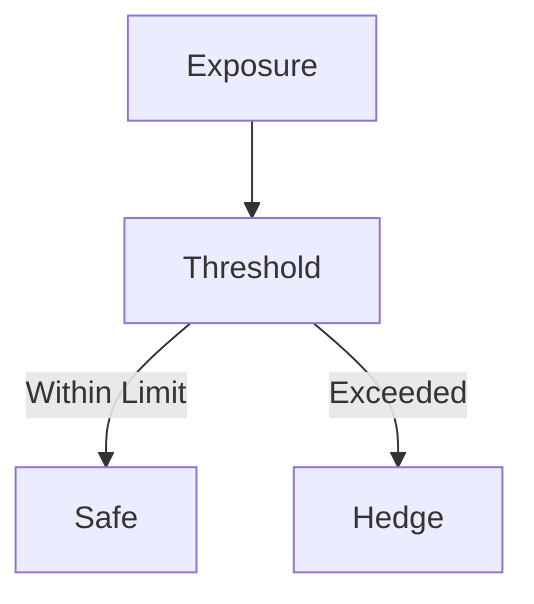

Only portfolios exceeding acceptable exposure generate hedge requests.

---

## Engineering Goals

The Risk Engine is designed to be:

- modular
- deterministic
- extensible
- numerically stable
- independent of networking

This separation allows pricing models and execution logic to evolve
independently.

---

# 💼 `portfolio.hpp`

## Purpose

The Portfolio module maintains the current financial state of the trading
system.

It acts as the central repository for positions, balances, and exposure,
providing the information required by the Risk Engine to make hedging
decisions.

---

## Responsibilities

- Track equity positions
- Track option positions
- Maintain cash balance
- Calculate aggregate exposure
- Record realized and unrealized profit and loss

---

## Portfolio Model

```text
Portfolio

├── Cash
├── Equity Positions
├── Option Positions
├── Market Value
├── Delta
├── Gamma
├── Vega
└── P&L
```

Each market update may modify one or more of these values.

---

## Separation of Responsibilities

The Portfolio module does **not** perform pricing calculations.

Instead:

- Pricing computes instrument values.
- Portfolio stores positions.
- Risk Engine evaluates exposure.

This separation simplifies testing and future expansion.

---

# 📤 `order_gateway.hpp`

## Purpose

The Order Gateway provides the interface between AeroHedge and an external
exchange or execution simulator.

It receives hedge instructions from the Risk Engine and converts them into
network messages suitable for transmission.

---

## Responsibilities

- Construct outbound orders
- Serialize execution messages
- Manage exchange connections
- Record execution timestamps
- Report order status

---

## Execution Flow

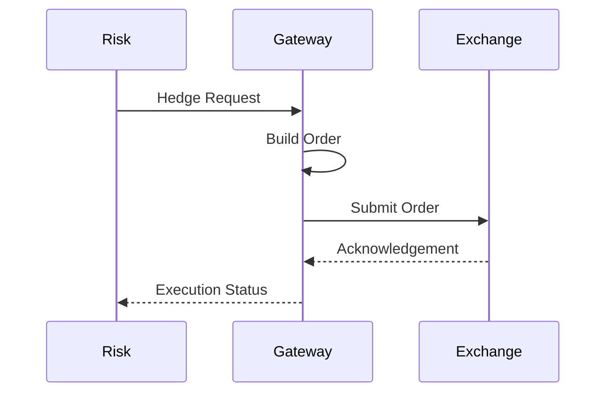

---

## Order Lifecycle

```text
Risk Decision

      │

      ▼

Create Order

      │

      ▼

Validate

      │

      ▼

Serialize

      │

      ▼

Transmit

      │

      ▼

Await Response
```

Each stage has a clearly defined responsibility, allowing execution logic to
remain isolated from pricing and portfolio management.

---

## Design Goals

The gateway emphasizes:

- modular networking
- deterministic behavior
- clean interfaces
- minimal coupling
- extensibility for multiple execution venues

Future implementations may support additional exchanges or simulation
environments without requiring changes to the pricing engine.

---

# 🔗 Module Relationships

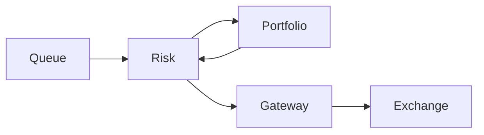

Each module owns a distinct responsibility and communicates only through
well-defined interfaces.

This layered architecture improves maintainability while allowing individual
components to evolve independently as the project grows.

---


---

# 📡 Observability & Telemetry Pipeline

High-performance software is only useful if engineers can understand what it
is doing. In latency-sensitive applications, however, collecting metrics must
never interfere with execution.

AeroHedge separates **execution** from **observation** through an asynchronous
telemetry architecture. The core engine publishes lightweight runtime metrics,
while a separate service transforms those metrics into a format suitable for
visualization.

This design allows developers to monitor the engine continuously without
placing additional work on the latency-critical execution pipeline.

---

# 🎯 Objectives

The telemetry subsystem is designed to provide real-time visibility into the
engine while preserving deterministic execution.

Its primary goals are:

- Observe execution without blocking worker threads
- Collect latency measurements
- Monitor portfolio state
- Track throughput
- Stream live metrics
- Support real-time dashboards

---

# 🏗 Telemetry Architecture

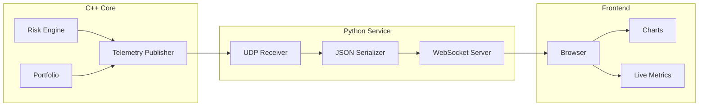

---

# 📦 `telemetry.hpp`

## Purpose

The telemetry module acts as the communication bridge between the trading
engine and external monitoring tools.

Instead of formatting strings or generating JSON inside latency-sensitive
threads, the engine simply packages numerical metrics into compact telemetry
messages.

These messages are forwarded asynchronously to the monitoring subsystem.

---

## Responsibilities

- Publish runtime metrics
- Record latency measurements
- Report portfolio statistics
- Stream execution events
- Support external visualization

---

## Telemetry Message

Representative telemetry fields include:

```text
TelemetryEvent

├── Timestamp
├── Instrument
├── Market Price
├── Net Delta
├── Net Gamma
├── Portfolio Value
├── Unrealized P&L
├── Queue Size
├── Processing Latency
└── Thread Identifier
```

These metrics provide a live snapshot of the engine's internal state.

---

# 📤 Publishing Workflow

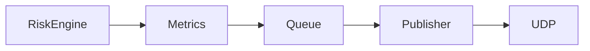

Publishing is intentionally lightweight so that execution threads spend as
little time as possible on observability.

---

# 🐍 `websocket_bridge.py`

## Purpose

The Python bridge converts binary telemetry into a format suitable for web
applications.

By moving serialization outside the C++ engine, AeroHedge keeps expensive text
processing away from the execution pipeline.

---

## Responsibilities

- Receive telemetry
- Decode binary messages
- Convert metrics into JSON
- Broadcast updates
- Serve WebSocket clients

---

## Processing Pipeline

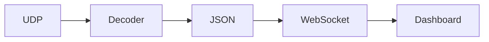

---

# 🌐 `dashboard.html`

## Purpose

The dashboard provides a live view of engine activity.

Rather than periodically refreshing data, it receives a continuous stream of
telemetry updates through a WebSocket connection.

---

## Dashboard Components

```text
Dashboard

├── Portfolio Value
├── Delta Exposure
├── Greeks
├── Latency
├── Throughput
├── Queue Depth
├── Recent Orders
└── Connection Status
```

---

# 📊 Live Metrics

Typical metrics displayed include:

| Metric | Description |
|---------|-------------|
| Net Delta | Aggregate portfolio exposure |
| Net Gamma | Curvature risk |
| Portfolio Value | Current valuation |
| Queue Depth | Pending market events |
| Tick Rate | Market updates per second |
| Orders Sent | Executed hedge requests |
| Average Latency | Mean processing time |
| Maximum Latency | Worst observed delay |

---

# 📈 Runtime Monitoring

```mermaid
flowchart TD

Tick

Risk

Metrics

Dashboard

Operator

Tick --> Risk

Risk --> Metrics

Metrics --> Dashboard

Dashboard --> Operator
```

This continuous feedback loop allows developers to observe system behaviour as
market conditions change.

---

# 📊 Performance Metrics

AeroHedge records representative performance statistics including:

- Market ticks processed
- Queue occupancy
- Pricing throughput
- Orders generated
- Processing latency
- Execution latency
- Message throughput

These measurements help identify performance bottlenecks during development
and testing.

---

# 🛠 Building the Project

## Requirements

- C++20 compiler
- CMake
- Python 3.11+
- FastAPI
- WebSockets
- Linux (recommended)

---

## Clone

```bash
git clone https://github.com/<username>/AeroHedge.git

cd AeroHedge
```

---

## Configure

```bash
cmake -S . -B build
```

---

## Build

```bash
cmake --build build
```

---

## Run

```bash
./build/aerohedge
```

---

## Dashboard

```bash
python websocket_bridge.py
```

Open your browser and navigate to the dashboard to observe live telemetry.

---

# 🧪 Testing Strategy

The project is designed to support multiple testing layers.

```text
Tests

├── Unit Tests
├── Queue Tests
├── Pricing Tests
├── Portfolio Tests
├── Networking Tests
├── Integration Tests
└── Performance Tests
```

Each subsystem can be validated independently before integration into the
complete pipeline.

---

# 🚀 Future Roadmap

Planned enhancements include:

- Multi-exchange connectivity
- Historical replay engine
- Backtesting framework
- Volatility surface calibration
- Portfolio optimization
- Additional pricing models
- Greeks beyond second order
- Strategy plug-in framework
- Persistent storage
- Automated benchmarking
- Distributed deployment
- GPU-accelerated analytics

---

# 📚 References

The design of AeroHedge draws inspiration from established concepts in:

- Modern C++ systems programming
- Concurrent software engineering
- Electronic trading systems
- Quantitative finance
- Market microstructure
- Lock-free programming
- Performance engineering

Recommended reading:

- *Options, Futures, and Other Derivatives* — John C. Hull
- *The C++ Programming Language* — Bjarne Stroustrup
- *Effective Modern C++* — Scott Meyers
- *Designing Data-Intensive Applications* — Martin Kleppmann
- *Computer Systems: A Programmer's Perspective* — Bryant & O'Hallaron

---

# 🤝 Contributing

Contributions are welcome.

Potential areas include:

- Performance optimization
- Additional pricing models
- Documentation
- Testing
- Dashboard improvements
- Networking enhancements

Please open an issue before making significant architectural changes.

---

# 📄 License

This project is distributed under the MIT License.

See the `LICENSE` file for additional information.

---

<div align="center">

## ⭐ If you found AeroHedge interesting, consider giving the repository a star!

**Built with Modern C++20, Quantitative Finance, and Low-Latency Systems Engineering.**

</div>
